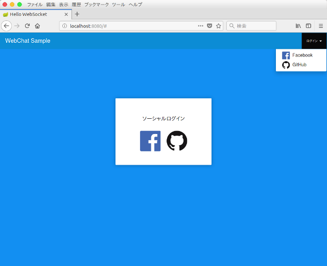
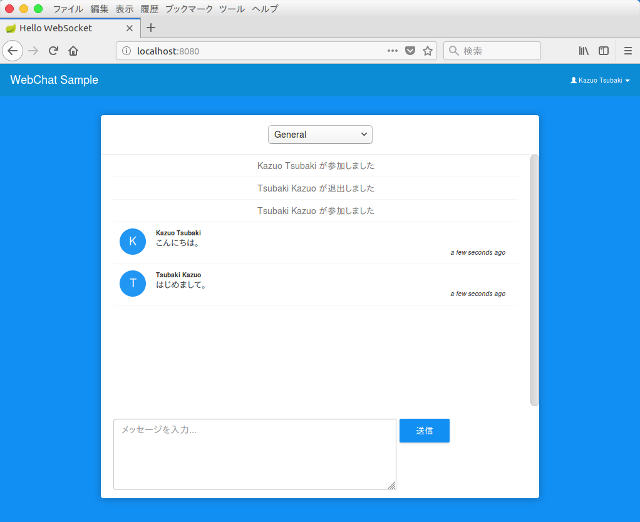

# chat-app

## 概要

Spring BootのWebSocketを使った簡単なチャットアプリケーション。

ソーシャルログイン機能を使ってチャットを開始します。
あらかじめソーシャルサービス（この場合はFacebookとGitHub）にアプリケーションの登録が必要です。

## 参考資料

- [Spring Boot and OAuth2](https://spring.io/guides/tutorials/spring-boot-oauth2/)
- [Using WebSocket to build an interactive web application](https://spring.io/guides/gs/messaging-stomp-websocket/)
- [AngularJS API Docs](https://code.angularjs.org/1.6.10/docs/api)